# Rely Gate System - Complete Workflow Documentation

## Table of Contents
1. [System Architecture Overview](#system-architecture-overview)
2. [Authentication & Authorization Workflows](#authentication--authorization-workflows)
3. [Multi-Tenant Onboarding Process](#multi-tenant-onboarding-process)
4. [Visitor Management Workflows](#visitor-management-workflows)
5. [Gatepass Management Workflows](#gatepass-management-workflows)
6. [OTP Verification Workflows](#otp-verification-workflows)
7. [Student & Staff Management Workflows](#student--staff-management-workflows)
8. [File Upload & QR Code Workflows](#file-upload--qr-code-workflows)
9. [Bulk Upload Workflows](#bulk-upload-workflows)
10. [Dashboard & Analytics Workflows](#dashboard--analytics-workflows)
11. [Emergency & Exception Handling](#emergency--exception-handling)
12. [User Journey Maps](#user-journey-maps)
13. [Decision Trees](#decision-trees)

---

## System Architecture Overview

### Multi-Tenant Security Model
```
┌─────────────────────────────────────────────────────────┐
│                   Request Processing                    │
├─────────────────────────────────────────────────────────┤
│ 1. Authentication (JWT Token Validation)               │
│ 2. Tenant Validation (TenantID from Token)             │
│ 3. Role-Based Authorization                             │
│ 4. Data Row-Level Security (TenantID in queries)       │
└─────────────────────────────────────────────────────────┘
```

### Data Flow Architecture
```
┌─────────────┐    ┌─────────────┐    ┌─────────────┐    ┌─────────────┐
│  Controller │ -> │   Service   │ -> │    Model    │ -> │  Database   │
│ (HTTP Layer)│    │ (Business)  │    │ (Data Access│    │ (PostgreSQL)│
└─────────────┘    └─────────────┘    └─────────────┘    └─────────────┘
      │                   │                   │                   │
      ↓                   ↓                   ↓                   ↓
- Request Validation  - Business Logic   - SQL Queries      - Row-Level
- Response Format     - Workflow Logic   - Data Transform   - Security
- Error Handling      - External APIs    - Audit Logging    - ACID Trans.
```

---

## Authentication & Authorization Workflows

### 1. User Login Workflow

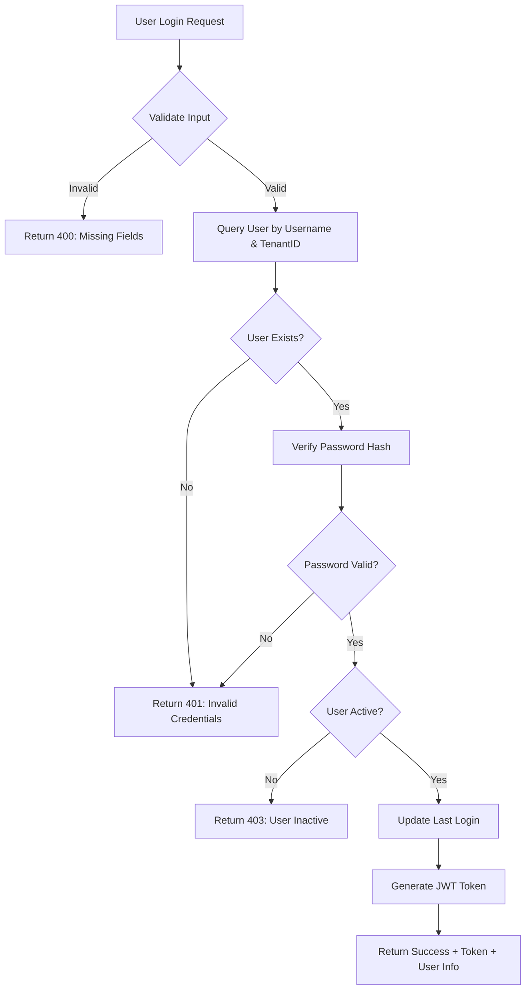

**Technical Implementation:**
- **File**: `/controllers/auth.controller.js` - `login()`
- **Security**: bcrypt password hashing, JWT token generation
- **Token Payload**: `{ loginId, username, tenantId, roleAccessId, roleName }`
- **Expiry**: 24 hours (configurable)

### 2. JWT Token Validation Middleware

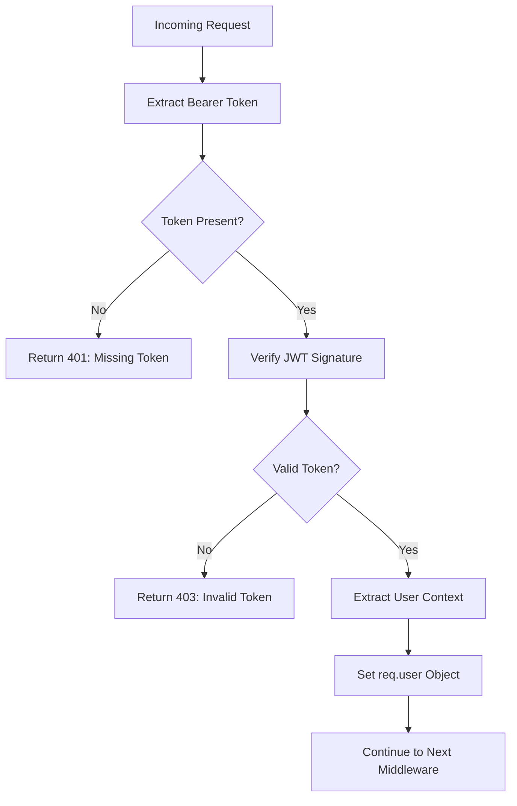

**Implementation Details:**
- **Middleware**: `/middleware/auth.js` - `authenticateToken()`
- **Token Extraction**: `Authorization: Bearer <token>`
- **User Context**: Available as `req.user` in all protected routes
- **Tenant Isolation**: Every request automatically scoped by tenant

### 3. Role-Based Authorization

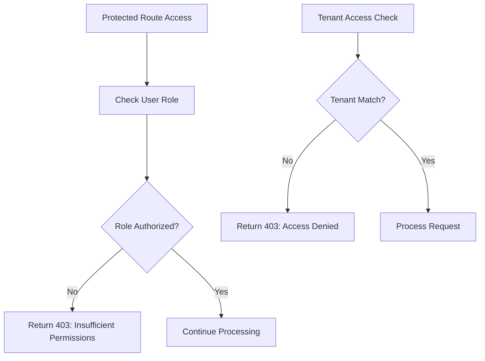

---

## Multi-Tenant Onboarding Process

### 1. Tenant Setup Workflow

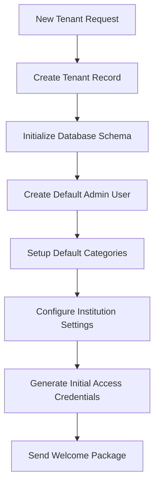

**Database Initialization:**
- **Tables**: All tables include `TenantID` column
- **Categories**: Visitor categories, purposes, subcategories
- **Users**: Initial admin user with full permissions
- **Settings**: Institution-specific configurations

### 2. Data Isolation Strategy

```
┌─────────────────────────────────────────────────────────┐
│                  Data Isolation Layers                 │
├─────────────────────────────────────────────────────────┤
│ 1. JWT Token carries TenantID                          │
│ 2. All SQL queries include WHERE TenantID = ?          │
│ 3. Middleware validates tenant access on every request │
│ 4. File uploads organized by tenant directories        │
│ 5. Analytics and reports filtered by tenant            │
└─────────────────────────────────────────────────────────┘
```

---

## Visitor Management Workflows

### 1. Registered Visitor Creation Workflow

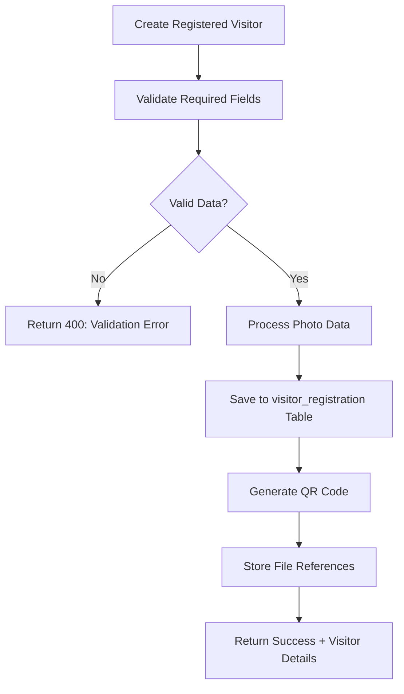

**Required Fields:**
- `vistorName`, `mobile`, `visitorCatId`, `visitorSubCatId`
- Optional: `email`, `flatId`, `vehicleNo`, `identityId`, `idNumber`

**File Processing:**
- **Photos**: Base64 → File → `/uploads/registered_visitors/`
- **Vehicle**: Base64 → File → `/uploads/vehicles/`
- **ID Documents**: Base64 → File → `/uploads/visitor_ids/`

### 2. Unregistered Visitor Check-in Workflow

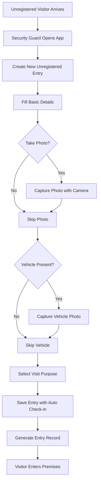

**Auto-Generated Fields:**
- `InTime`: Current timestamp
- `IntimeTxt`: Formatted time string
- `VisitorNumber`: Auto-generated unique number
- `Status`: "CHECKED_IN"

### 3. Visitor Check-out Workflow

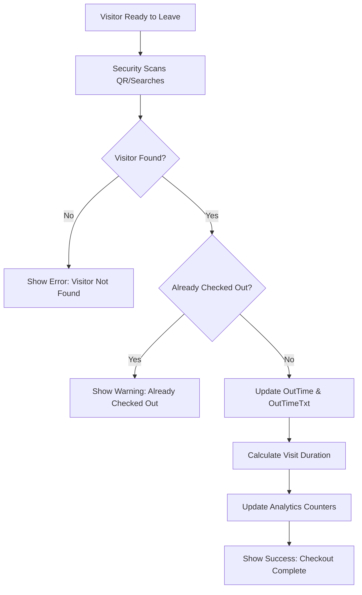

### 4. OTP Verification for Registered Visitors

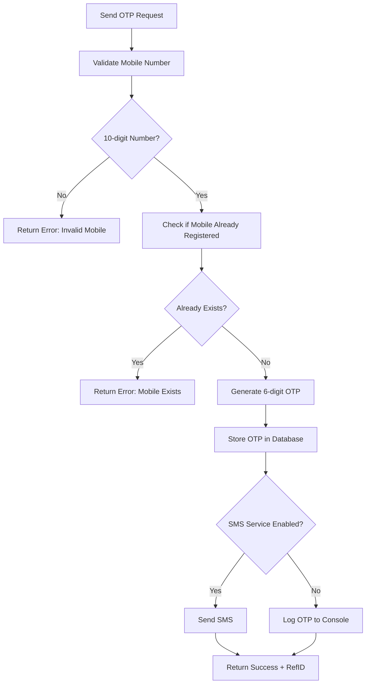

**OTP Verification Process:**
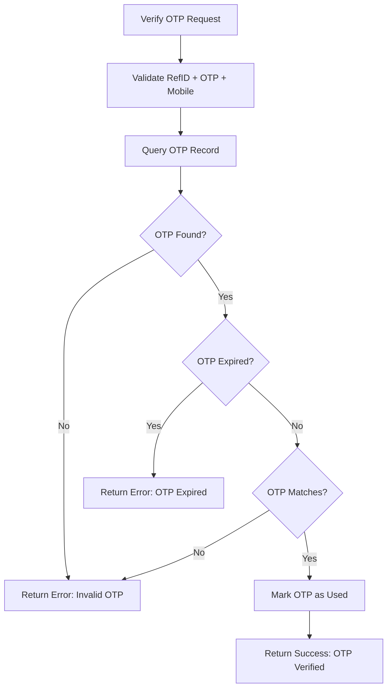

---

## Gatepass Management Workflows

### 1. Gatepass Creation Workflow

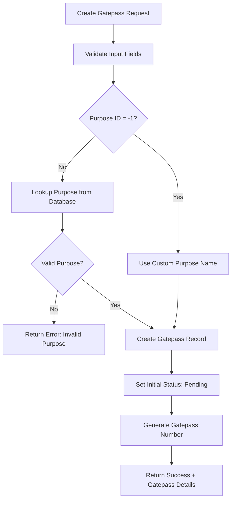

**Gatepass Statuses:**
- `1`: Pending Approval
- `2`: Approved
- `3`: Checked In
- `4`: Checked Out
- `5`: Rejected

### 2. Gatepass Approval Workflow

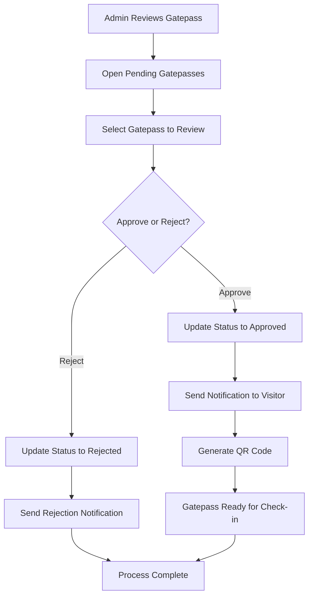

### 3. Gatepass Check-in/Check-out Workflow

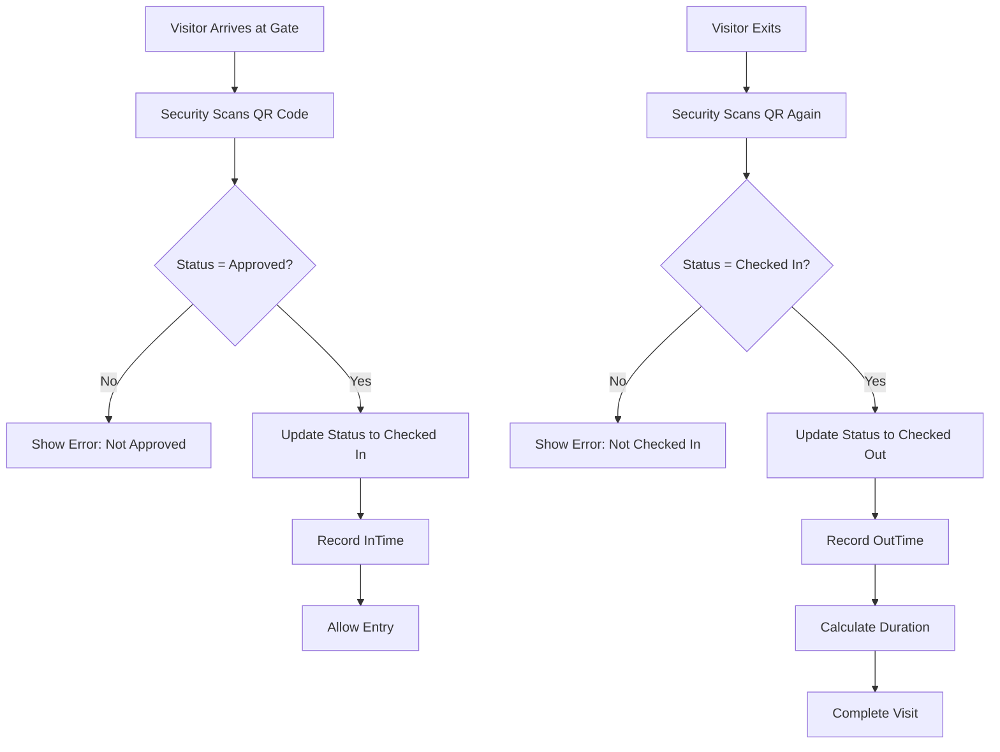

---

## OTP Verification Workflows

### 1. OTP Generation Process

```mermaid
flowchart TD
    A[OTP Request] --> B[Generate Random 6-digit Code]
    B --> C[Create Unique Reference ID]
    C --> D[Set Expiry Time (5 minutes)]
    D --> E[Store in otp_verification Table]
    
    E --> F{SMS Service Available?}
    F -->|Yes| G[Send SMS via Provider]
    F -->|No| H[Log OTP to Console/File]
    
    G --> I[Return RefID to Client]
    H --> I
```

### 2. OTP Use Cases

**Scenario 1: Registered Visitor OTP**
- **Purpose**: Verify mobile before creating visitor registration
- **Flow**: Send OTP → Verify → Create Visitor Registration
- **Validation**: Check if mobile already exists for tenant

**Scenario 2: Unregistered Visitor OTP**
- **Purpose**: Quick verification for walk-in visitors
- **Flow**: Send OTP → Verify → Immediate Check-in
- **Use Case**: When visitor doesn't want full registration

**Scenario 3: Staff/Student Mobile Verification**
- **Purpose**: Validate mobile numbers during bulk uploads
- **Flow**: Automated OTP generation during CSV processing
- **Validation**: Ensure unique mobile per tenant

### 3. OTP Security Features

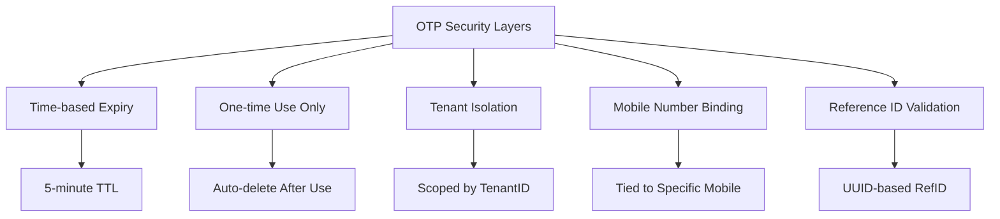

---

## Student & Staff Management Workflows

### 1. Student Registration Workflow

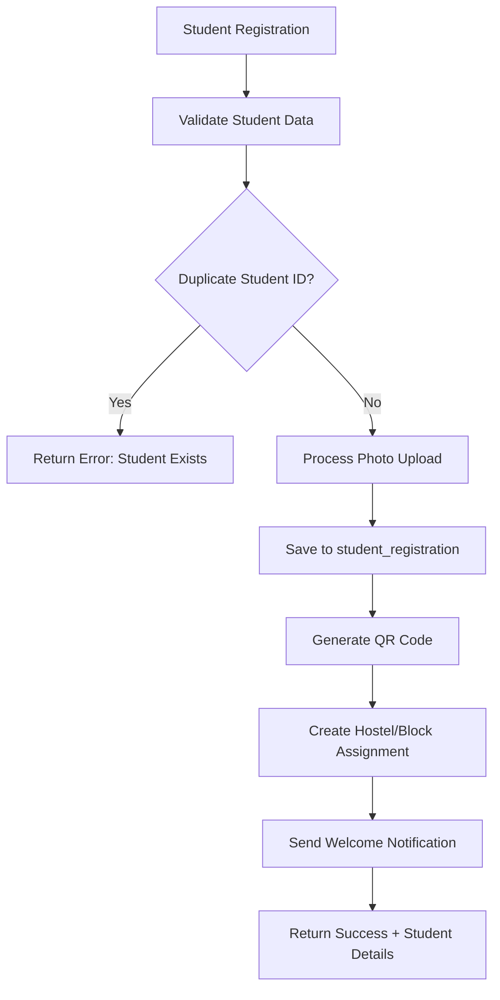

### 2. Staff Registration Workflow

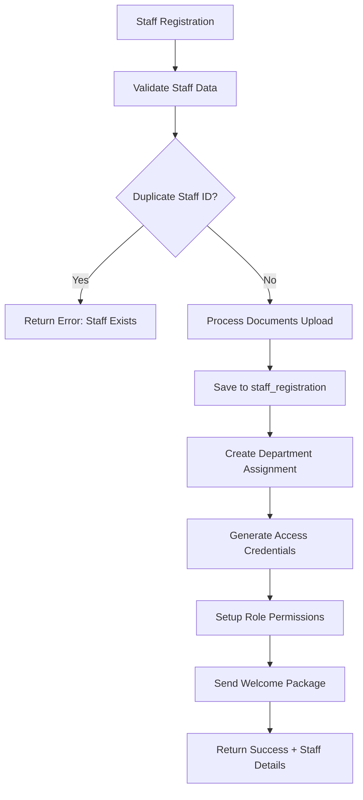

### 3. Access Control Integration

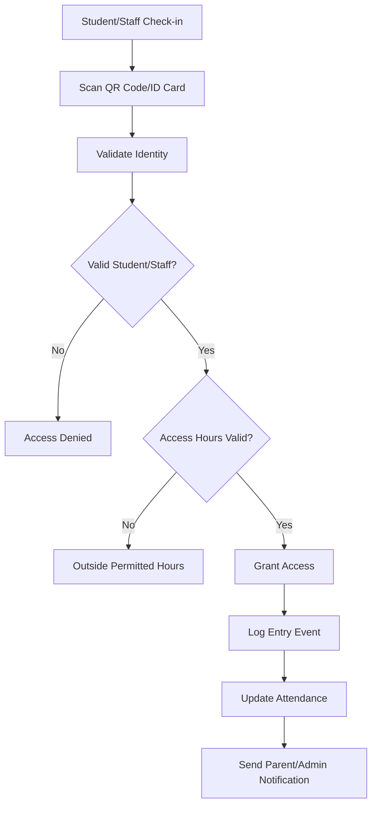

---

## File Upload & QR Code Workflows

### 1. File Upload Processing Workflow

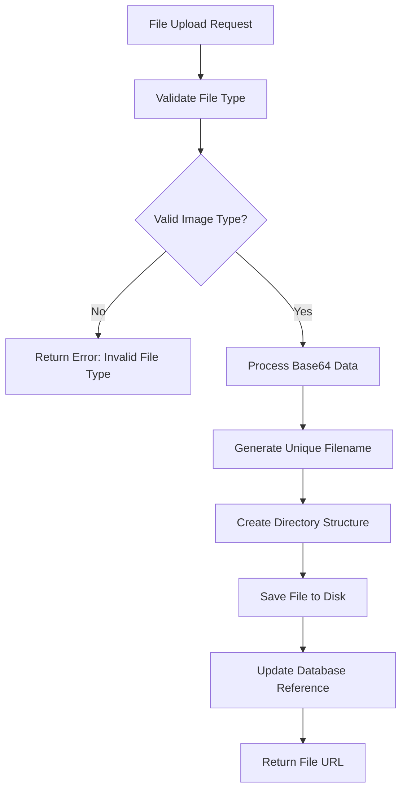

**Directory Structure:**
```
uploads/
├── registered_visitors/{tenantId}/
├── unregistered/{tenantId}/
├── vehicles/{tenantId}/
├── visitor_ids/{tenantId}/
├── students/{tenantId}/
├── staff/{tenantId}/
└── qr_codes/{tenantId}/
```

### 2. QR Code Generation Workflow

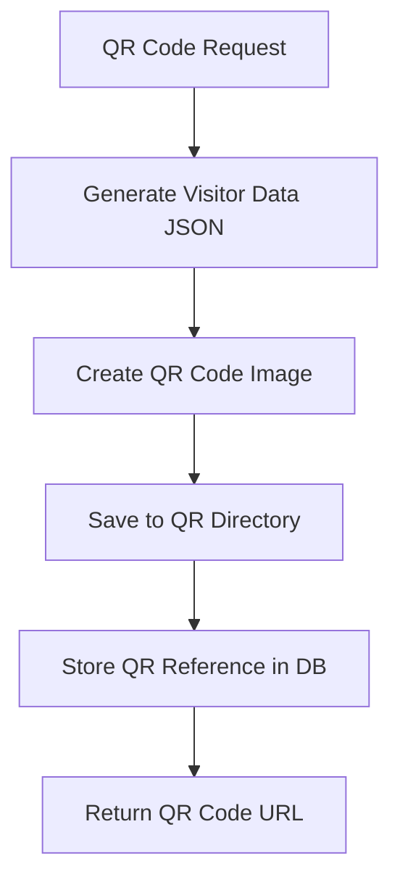

**QR Code Data Structure:**
```json
{
  "visitorId": 123,
  "tenantId": 1,
  "visitorType": "registered|unregistered|gatepass",
  "generated": "2024-06-30T10:00:00Z",
  "expires": "2024-07-01T10:00:00Z"
}
```

### 3. QR Code Scanning Workflow

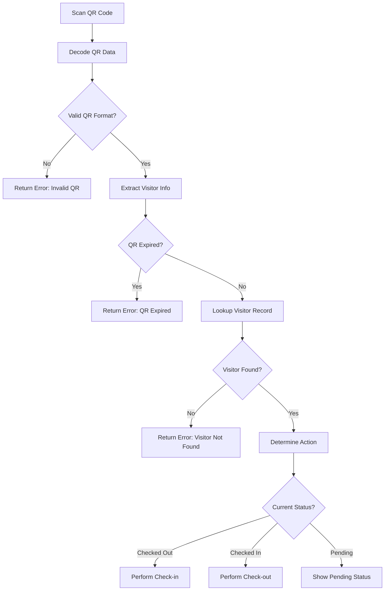

---

## Bulk Upload Workflows

### 1. CSV Upload Processing Workflow

```mermaid
flowchart TD
    A[CSV Upload Request] --> B[Validate File Extension]
    B --> C{Valid CSV?}
    C -->|No| D[Return Error: Invalid File]
    C -->|Yes| E[Parse CSV Content]
    
    E --> F[Validate Headers]
    F --> G{Headers Match Template?}
    G -->|No| H[Return Error: Invalid Headers]
    G -->|Yes| I[Process Each Row]
    
    I --> J[Validate Row Data]
    J --> K{Valid Row?}
    K -->|No| L[Add to Error List]
    K -->|Yes| M[Process Row Data]
    
    M --> N[Save to Database]
    N --> O[Continue to Next Row]
    O --> P{More Rows?}
    P -->|Yes| I
    P -->|No| Q[Generate Processing Report]
    
    L --> O
    Q --> R[Return Results + Errors]
```

### 2. Student Bulk Upload Workflow

```mermaid
flowchart TD
    A[Student CSV Upload] --> B[Validate Student Headers]
    B --> C[Process Each Student Record]
    C --> D{Duplicate Student ID?}
    D -->|Yes| E[Skip + Add Warning]
    D -->|No| F[Validate Required Fields]
    
    F --> G{All Fields Valid?}
    G -->|No| H[Add to Error List]
    G -->|Yes| I[Create Student Record]
    
    I --> J[Generate QR Code]
    J --> K[Setup Hostel Assignment]
    K --> L[Continue Processing]
    
    E --> L
    H --> L
    L --> M{More Records?}
    M -->|Yes| C
    M -->|No| N[Generate Summary Report]
```

**CSV Template Fields:**
- **Students**: `Student_ID, Name, Mobile, Email, Course, Hostel, Vehicle_Number`
- **Staff**: `Staff_ID, Name, Mobile, Email, Designation, Department, Address, Vehicle_Number`
- **Visitors**: `Name, Mobile, Email, Flat_Name, Vehicle_Number, ID_Type, ID_Number, Purpose`

### 3. Bulk Upload Error Handling

```mermaid
flowchart TD
    A[Bulk Processing] --> B[Collect All Errors]
    B --> C[Categorize Error Types]
    C --> D[Validation Errors]
    C --> E[Duplicate Errors] 
    C --> F[System Errors]
    
    D --> G[Generate Error CSV]
    E --> G
    F --> G
    
    G --> H[Return Processing Summary]
    H --> I[Show Success Count]
    H --> J[Show Error Count]
    H --> K[Provide Error Download]
```

---

## Dashboard & Analytics Workflows

### 1. Real-time Dashboard Data Flow

```mermaid
flowchart TD
    A[Dashboard Request] --> B[Query Today's Stats]
    B --> C[Calculate Visitor Counts]
    C --> D[Get Check-in/Check-out Numbers]
    D --> E[Fetch Pending Approvals]
    E --> F[Get Recent Activity]
    F --> G[Calculate Duration Metrics]
    G --> H[Format Response Data]
    H --> I[Return Dashboard JSON]
```

**Dashboard Metrics:**
- **Today's Visitors**: Total check-ins for current date
- **Currently Inside**: Checked-in but not checked-out
- **Average Visit Duration**: Calculated from completed visits
- **Pending Gatepasses**: Awaiting approval
- **Recent Activity**: Last 10 visitor movements
- **Category Breakdown**: Visitors by purpose/category

### 2. Analytics Data Processing

```mermaid
flowchart TD
    A[Analytics Request] --> B[Define Date Range]
    B --> C[Query Visit History]
    C --> D[Calculate Visit Patterns]
    D --> E[Group by Categories]
    E --> F[Calculate Peak Hours]
    F --> G[Generate Trends]
    G --> H[Create Visualizations Data]
    H --> I[Return Analytics Response]
```

### 3. Report Generation Workflow

```mermaid
flowchart TD
    A[Generate Report] --> B[Select Report Type]
    B --> C[Daily Report]
    B --> D[Weekly Report]
    B --> E[Monthly Report]
    B --> F[Custom Range Report]
    
    C --> G[Query Today's Data]
    D --> H[Query Week's Data]
    E --> I[Query Month's Data]
    F --> J[Query Custom Range]
    
    G --> K[Format as CSV/PDF]
    H --> K
    I --> K
    J --> K
    
    K --> L[Return Download Link]
```

---

## Emergency & Exception Handling

### 1. Emergency Access Workflow

```mermaid
flowchart TD
    A[Emergency Situation] --> B[Security Override Mode]
    B --> C[Bypass Normal Approval]
    C --> D[Log Emergency Entry]
    D --> E[Notify Admin Immediately]
    E --> F[Allow Immediate Access]
    F --> G[Create Emergency Record]
    G --> H[Follow-up Required]
```

### 2. System Failure Handling

```mermaid
flowchart TD
    A[System Failure Detected] --> B{Database Available?}
    B -->|No| C[Switch to Offline Mode]
    B -->|Yes| D{Network Available?}
    
    C --> E[Log Locally]
    E --> F[Sync When Online]
    
    D -->|No| G[Cache Critical Data]
    D -->|Yes| H[Continue Normal Operation]
    
    G --> I[Queue Operations]
    I --> J[Process When Connected]
```

### 3. Data Inconsistency Resolution

```mermaid
flowchart TD
    A[Data Inconsistency Detected] --> B[Log Inconsistency]
    B --> C[Determine Severity]
    C --> D{Critical Issue?}
    D -->|Yes| E[Alert Admin Immediately]
    D -->|No| F[Add to Review Queue]
    
    E --> G[Manual Intervention Required]
    F --> H[Auto-correction Attempt]
    
    H --> I{Auto-fix Successful?}
    I -->|No| J[Escalate to Admin]
    I -->|Yes| K[Log Resolution]
```

---

## User Journey Maps

### 1. Security Guard Journey

```mermaid
journey
    title Security Guard Daily Workflow
    section Morning Setup
      Login to App: 5: Guard
      Check Pending Gatepasses: 4: Guard
      Review Today's Approvals: 4: Guard
    section Visitor Arrival
      Greet Visitor: 5: Guard, Visitor
      Check Registration Status: 3: Guard
      Process Check-in: 4: Guard
      Take Photos if Required: 3: Guard
      Issue Visitor Badge: 5: Guard, Visitor
    section During Visit
      Monitor Dashboard: 4: Guard
      Handle Emergency Access: 2: Guard
      Process Additional Visitors: 4: Guard
    section Visitor Departure
      Scan QR Code: 5: Guard
      Process Check-out: 5: Guard
      Calculate Visit Duration: 4: Guard
      Update Records: 4: Guard
    section End of Shift
      Review Day's Activity: 4: Guard
      Generate Shift Report: 3: Guard
      Handover to Next Shift: 5: Guard
```

### 2. Admin User Journey

```mermaid
journey
    title Admin User Daily Workflow
    section Morning Review
      Login to Dashboard: 5: Admin
      Review Overnight Activity: 4: Admin
      Check Pending Approvals: 4: Admin
    section Gatepass Management
      Review Gatepass Requests: 3: Admin
      Approve/Reject Requests: 4: Admin
      Send Notifications: 5: Admin
    section Data Management
      Upload Bulk Data: 3: Admin
      Review Error Reports: 2: Admin
      Fix Data Issues: 3: Admin
    section Analytics Review
      Generate Reports: 4: Admin
      Analyze Visitor Patterns: 4: Admin
      Plan Capacity Management: 4: Admin
    section System Maintenance
      Monitor System Health: 4: Admin
      Handle Support Requests: 3: Admin
      Configure Settings: 4: Admin
```

### 3. Visitor Journey

```mermaid
journey
    title Visitor Experience Journey
    section Pre-Visit (Registered)
      Submit Gatepass Request: 4: Visitor
      Receive Approval Notification: 5: Visitor
      Download QR Code: 5: Visitor
    section Arrival
      Approach Security Gate: 3: Visitor, Guard
      Show QR Code/ID: 4: Visitor, Guard
      Photo Verification: 3: Visitor, Guard
      Receive Visitor Badge: 5: Visitor, Guard
    section During Visit
      Navigate to Destination: 5: Visitor
      Complete Visit Purpose: 5: Visitor
      Prepare for Departure: 4: Visitor
    section Departure
      Return to Security Gate: 4: Visitor, Guard
      QR Code Scan for Checkout: 5: Visitor, Guard
      Return Visitor Badge: 4: Visitor, Guard
      Exit Premises: 5: Visitor, Guard
```

---

## Decision Trees

### 1. Visitor Processing Decision Tree

```mermaid
graph TD
    A[Visitor Arrives] --> B{Pre-registered?}
    B -->|Yes| C{Has QR Code?}
    B -->|No| D[Create Unregistered Entry]
    
    C -->|Yes| E[Scan QR Code]
    C -->|No| F[Search by Mobile/Name]
    
    E --> G{QR Valid?}
    G -->|Yes| H[Process Check-in]
    G -->|No| I[Manual Verification Required]
    
    F --> J{Visitor Found?}
    J -->|Yes| H
    J -->|No| K[Create New Registration]
    
    D --> L{Identity Verification Required?}
    L -->|Yes| M[Capture Photo & ID]
    L -->|No| N[Basic Details Only]
    
    M --> O[Complete Check-in]
    N --> O
    H --> O
    K --> O
    I --> P[Manual Override Decision]
    P --> O
```

### 2. Gatepass Approval Decision Tree

```mermaid
graph TD
    A[Gatepass Request] --> B{All Required Fields Present?}
    B -->|No| C[Request Additional Information]
    B -->|Yes| D{Visit Date Valid?}
    
    D -->|No| E[Reject: Invalid Date]
    D -->|Yes| F{Purpose Appropriate?}
    
    F -->|No| G[Request Purpose Clarification]
    F -->|Yes| H{Visitor Previously Banned?}
    
    H -->|Yes| I[Reject: Security Concern]
    H -->|No| J{Capacity Available?}
    
    J -->|No| K[Suggest Alternative Time]
    J -->|Yes| L[Auto-Approve or Manual Review?]
    
    L -->|Auto| M[Approve Immediately]
    L -->|Manual| N[Queue for Admin Review]
    
    C --> O[Awaiting Response]
    G --> O
    K --> O
    N --> P[Admin Decision Required]
    P --> Q{Admin Approves?}
    Q -->|Yes| M
    Q -->|No| R[Send Rejection Notice]
```

### 3. Emergency Access Decision Tree

```mermaid
graph TD
    A[Emergency Access Request] --> B{Life Safety Emergency?}
    B -->|Yes| C[Grant Immediate Access]
    B -->|No| D{Security Emergency?}
    
    D -->|Yes| E[Verify Authority]
    D -->|No| F{Maintenance Emergency?}
    
    E --> G{Authority Verified?}
    G -->|Yes| H[Grant Access + Alert Admin]
    G -->|No| I[Deny Access + Security Alert]
    
    F --> J{Authorized Personnel?}
    J -->|Yes| K[Grant Limited Access]
    J -->|No| L[Standard Approval Process]
    
    C --> M[Log Emergency Entry]
    H --> M
    K --> N[Log Maintenance Entry]
    
    M --> O[Immediate Admin Notification]
    N --> P[Routine Admin Notification]
    I --> Q[Security Team Alert]
    L --> R[Normal Workflow]
```

### 4. Data Validation Decision Tree

```mermaid
graph TD
    A[Data Input] --> B{Required Fields Present?}
    B -->|No| C[Return Validation Error]
    B -->|Yes| D{Data Format Valid?}
    
    D -->|No| E[Return Format Error]
    D -->|Yes| F{Business Rules Satisfied?}
    
    F -->|No| G[Return Business Rule Error]
    F -->|Yes| H{Duplicate Check?}
    
    H -->|Duplicate Found| I{Allow Duplicates?}
    H -->|No Duplicate| J[Proceed with Processing]
    
    I -->|No| K[Return Duplicate Error]
    I -->|Yes| L[Add Duplicate Warning]
    
    L --> M[Proceed with Caution]
    J --> N[Normal Processing]
    M --> N
    
    C --> O[Show Error to User]
    E --> O
    G --> O
    K --> O
```

---

## Data Flow Diagrams

### 1. Complete Visitor Check-in Data Flow

```
┌─────────────┐    ┌─────────────┐    ┌─────────────┐    ┌─────────────┐
│   Mobile    │    │    API      │    │  Database   │    │   File      │
│     App     │───▶│  Gateway    │───▶│   Server    │───▶│   Storage   │
└─────────────┘    └─────────────┘    └─────────────┘    └─────────────┘
      │                   │                   │                   │
      ▼                   ▼                   ▼                   ▼
1. Capture Visitor     2. Validate          3. Insert Visitor   4. Store Photos
   Photos & Data          Request              Record              & Documents
      │                   │                   │                   │
      ▼                   ▼                   ▼                   ▼
5. Generate QR Code    6. Process            7. Update           8. Send
   ◄───────────────────── Business           Analytics          Notifications
                         Logic               Counters
```

### 2. Multi-Tenant Data Isolation Flow

```
┌─────────────────────────────────────────────────────────┐
│                 Request Processing Flow                 │
├─────────────────────────────────────────────────────────┤
│                                                         │
│  JWT Token → Extract TenantID → Validate Access        │
│      │              │                 │                │
│      ▼              ▼                 ▼                │
│  LoginID       TenantID=1        Role=Admin            │
│  Username      Database          Permissions           │
│  Expiry        Queries           Authorization         │
│                                                        │
│  ┌─────────────────────────────────────────────────┐   │
│  │  All Database Operations Include:               │   │
│  │  WHERE TenantID = ? AND IsActive = 'Y'          │   │
│  │                                                 │   │
│  │  File Paths Include:                            │   │
│  │  /uploads/{category}/{tenantId}/{filename}      │   │
│  └─────────────────────────────────────────────────┘   │
└─────────────────────────────────────────────────────────┘
```

---

## Performance & Scalability Considerations

### 1. Database Query Optimization

```sql
-- Optimized Visitor Query with Proper Indexing
SELECT v.*, c.categoryname, s.subcategoryname 
FROM visitor_registration v
JOIN visitor_category c ON v.visitorcatid = c.visitorcatid 
    AND c.tenantid = v.tenantid
JOIN visitor_subcategory s ON v.visitorsubcatid = s.visitorsubcatid 
    AND s.tenantid = v.tenantid
WHERE v.tenantid = ? 
    AND v.isactive = 'Y'
    AND v.createdon >= CURRENT_DATE
ORDER BY v.createdon DESC
LIMIT 50 OFFSET ?;

-- Recommended Indexes
CREATE INDEX idx_visitor_tenant_active_date ON visitor_registration(tenantid, isactive, createdon);
CREATE INDEX idx_visitor_mobile_tenant ON visitor_registration(mobile, tenantid);
CREATE INDEX idx_visitor_status_tenant ON visitor_history(tenantid, status, intimestamp);
```

### 2. File Storage Strategy

```
File Storage Organization:
├── uploads/
│   ├── registered_visitors/
│   │   ├── tenant_1/
│   │   │   ├── 2024/06/30/
│   │   │   │   ├── 1719750000_abc123.jpg
│   │   │   │   └── 1719750060_def456.jpg
│   │   └── tenant_2/
│   ├── vehicles/
│   ├── qr_codes/
│   └── temp/ (auto-cleanup after 24 hours)
```

### 3. Caching Strategy

```mermaid
graph TD
    A[Client Request] --> B{Cache Hit?}
    B -->|Yes| C[Return Cached Data]
    B -->|No| D[Query Database]
    
    D --> E[Process Data]
    E --> F[Store in Cache]
    F --> G[Return Data]
    
    H[Cache Invalidation] --> I{Data Modified?}
    I -->|Yes| J[Clear Related Cache]
    I -->|No| K[Keep Cache]
```

**Cacheable Data:**
- Visitor categories and subcategories
- Purpose lists
- User permissions
- Dashboard counters (5-minute TTL)

---

## Security Implementation Details

### 1. Input Validation & Sanitization

```javascript
// Example Validation Middleware
const validateVisitorData = (req, res, next) => {
  const { fname, mobile, visitorCatId } = req.body;
  
  // Sanitize inputs
  req.body.fname = fname?.trim().replace(/[<>]/g, '');
  req.body.mobile = mobile?.replace(/\D/g, ''); // Only digits
  
  // Validate required fields
  if (!req.body.fname || req.body.fname.length < 2) {
    return res.status(400).json({
      responseCode: 'E',
      responseMessage: 'Valid name is required (min 2 characters)'
    });
  }
  
  // Validate mobile number
  if (!/^\d{10}$/.test(req.body.mobile)) {
    return res.status(400).json({
      responseCode: 'E',
      responseMessage: 'Valid 10-digit mobile number required'
    });
  }
  
  next();
};
```

### 2. SQL Injection Prevention

```javascript
// Always use parameterized queries
const getUsersByTenant = async (tenantId, searchTerm) => {
  const query = `
    SELECT loginid, username, rolename 
    FROM login_user 
    WHERE tenantid = $1 
      AND isactive = 'Y' 
      AND (username ILIKE $2 OR displayn ILIKE $2)
    ORDER BY username
    LIMIT 50
  `;
  
  return await db.query(query, [tenantId, `%${searchTerm}%`]);
};
```

### 3. File Upload Security

```javascript
const validateFileUpload = (file) => {
  // Allowed file types
  const allowedTypes = ['image/jpeg', 'image/png', 'image/jpg'];
  
  // Maximum file size (2MB)
  const maxSize = 2 * 1024 * 1024;
  
  if (!allowedTypes.includes(file.mimetype)) {
    throw new Error('Invalid file type. Only JPG, JPEG, PNG allowed.');
  }
  
  if (file.size > maxSize) {
    throw new Error('File too large. Maximum size is 2MB.');
  }
  
  return true;
};
```

---

## Monitoring & Logging

### 1. Application Logging Strategy

```javascript
const auditLog = {
  // User actions
  userLogin: (username, tenantId, ip) => {
    console.log(`[AUDIT] Login: ${username} | Tenant: ${tenantId} | IP: ${ip} | Time: ${new Date().toISOString()}`);
  },
  
  // Visitor operations
  visitorCheckin: (visitorId, tenantId, performedBy) => {
    console.log(`[VISITOR] Check-in: ID ${visitorId} | Tenant: ${tenantId} | By: ${performedBy} | Time: ${new Date().toISOString()}`);
  },
  
  // Security events
  unauthorizedAccess: (endpoint, ip, tenantId) => {
    console.log(`[SECURITY] Unauthorized access attempt: ${endpoint} | IP: ${ip} | Tenant: ${tenantId} | Time: ${new Date().toISOString()}`);
  },
  
  // System errors
  systemError: (error, context) => {
    console.error(`[ERROR] ${error.message} | Context: ${JSON.stringify(context)} | Stack: ${error.stack}`);
  }
};
```

### 2. Performance Monitoring

```javascript
// API Response Time Monitoring
const performanceMiddleware = (req, res, next) => {
  const start = Date.now();
  
  res.on('finish', () => {
    const duration = Date.now() - start;
    const logLevel = duration > 1000 ? 'WARN' : 'INFO';
    
    console.log(`[${logLevel}] ${req.method} ${req.path} | ${duration}ms | Status: ${res.statusCode} | Tenant: ${req.user?.tenantId || 'N/A'}`);
    
    // Alert if response time > 5 seconds
    if (duration > 5000) {
      console.error(`[ALERT] Slow response detected: ${req.path} took ${duration}ms`);
    }
  });
  
  next();
};
```

---

This comprehensive workflow documentation covers all major business processes in the Rely Gate system. Each workflow includes technical implementation details, security considerations, and decision points that guide the system behavior. The documentation serves as both a technical reference for developers and a business process guide for stakeholders.